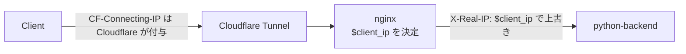

# バックエンド ログ出力 実装方針

対象: `app/python-backend` (Flask 3 + gunicorn)

## 1. 目的と方針

ログで答えたい問いは次の 3 つ。

| 目的 | 知りたいこと |
|---|---|
| 障害調査 | どのリクエストが、どの入力で、なぜ失敗したか |
| 運用監視 | リクエスト数・エラー率・処理時間 (特に Raspberry Pi 上の変換・描画時間) |
| 不正利用の調査 | どの IP / クライアントから、どれくらいの頻度でアクセスされたか |

基本方針:

- **構造化ログ (JSON 1 行 1 イベント)** を **stdout** に出す。収集・保存は Docker 側に任せる
- `event` は固定のドット区切り名にし、値はメッセージに埋め込まずフィールドに分ける
- 1 リクエストのログは `request_id` で束ねられるようにする
- 利用者のデータ (SVG / CSV の中身、ファイル名) と秘密情報 (Cookie、Access のトークン等) は出さない
- 平常時のログは軽く、失敗時には調査に必要な材料が必ず残るようにする

## 2. ライブラリ: structlog

`structlog==26.1.0` を `requirements.txt` にバージョン固定で追加する。

| 候補 | 判断 |
|---|---|
| **structlog** (採用) | JSON 出力、`contextvars` による request_id の自動付与、例外整形、開発用のカラー表示が同梱。標準 `logging` にも橋渡しでき、gunicorn / werkzeug のログも同じ形式に揃えられる |
| python-json-logger | JSON フォーマッタのみ。request_id の Filter や開発用表示の切り替えは自作になる |
| loguru | 標準 `logging` と二重管理になり、gunicorn との統合に手間がかかる |

## 3. ログの形式

### 3.1 共通フィールド

全行に付くもの:

| キー | 例 | 備考 |
|---|---|---|
| `timestamp` | `2026-09-26T01:23:45.678Z` | UTC、ISO 8601 |
| `level` | `info` | |
| `event` | `request.completed` | 集計のキー |
| `logger` | `service.converter_service` | `getLogger(__name__)` の名前 |

リクエスト処理中に出る行に付くもの (`contextvars` で自動付与):

| キー | 例 | 備考 |
|---|---|---|
| `request_id` | `9f1c2a...` | 4 章参照 |
| `cf_ray` | `8c7a...-NRT` | `CF-Ray` ヘッダがある場合のみ |

### 3.2 イベント一覧

| event | level | 追加フィールド | 出す場所 |
|---|---|---|---|
| `request.completed` | 2xx/3xx: info, 4xx: warning, 5xx: error | `method`, `path`, `status`, `duration_ms`, `content_length`, `client_ip`, `user_agent`, (4xx/5xx 時) `reason`, `request` | `after_request`。`/healthz` は除外 |
| `convert.completed` | info | `svg_bytes`, `power`, `speed`, `svg2csv_ms`, `plot_ms`, `csv_bytes` | `ConvertService.convert` |
| `convert.failed` | error | `exception` (スタックトレースの文字列) | `/svg2csv` の `except Exception` (現在の `logging.exception` を置き換え) |

- 4xx はクライアントの入力ミスなので `warning` 止まりにし、`error` は「対応が必要なもの」に限る
- エラー件数の集計は `event == "convert.failed"` で行う (`request.completed` の 5xx と二重に数えない)

### 3.3 `reason` コード

`RequestError` のメッセージは利用者向けの日本語なので、集計用に安定したコードを別に持たせる。利用者に返すメッセージは変えない。

| reason | 発生箇所 | status |
|---|---|---|
| `missing_params` | `json_data` が無い | 400 |
| `invalid_params` | JSON 不正、`power` / `speed` の欠落・型不正 | 400 |
| `out_of_range` | `power` / `speed` の範囲外 | 400 |
| `no_file` | ファイル未選択 | 400 |
| `invalid_extension` | 拡張子が `.svg` でない | 400 |
| `invalid_svg` | `InvalidSvgError` | 400 |
| `too_large` | `MAX_CONTENT_LENGTH` 超過 | 413 |
| `internal_error` | 変換中の想定外の例外 | 500 |

実装: コードは `error_reason.py` の `ErrorReason` (`StrEnum`) で定義する。文字列リテラルを散らばらせず、打ち間違いを防ぐため。`StrEnum` は `str` でもあるので、JSON には `"out_of_range"` のような文字列のまま出る。`RequestError(message, ErrorReason.XXX)` とし、ハンドラで `g.log_reason` に積んで `after_request` が拾う。コードを追加・変更するときは、この表と `tests/test_error_reason.py` も更新する。

### 3.4 出力例

成功時:

```json
{"timestamp":"2026-09-26T01:23:45.678Z","level":"info","event":"convert.completed","logger":"service.converter_service","request_id":"9f1c2a...","svg_bytes":48213,"power":0.5,"speed":1000,"svg2csv_ms":120,"plot_ms":640,"csv_bytes":20411}
{"timestamp":"2026-09-26T01:23:45.690Z","level":"info","event":"request.completed","logger":"request_logging","request_id":"9f1c2a...","client_ip":"203.0.113.5","user_agent":"Mozilla/5.0 (Macintosh; ...)","method":"POST","path":"/svg2csv","status":200,"duration_ms":781,"content_length":48900}
```

入力エラー時:

```json
{"timestamp":"...","level":"warning","event":"request.completed","logger":"request_logging","request_id":"9f1c...","client_ip":"203.0.113.5","user_agent":"Mozilla/5.0 ...","method":"POST","path":"/svg2csv","status":400,"reason":"out_of_range","duration_ms":3,
 "request":{
   "headers":{"Content-Type":"multipart/form-data; boundary=...","User-Agent":"Mozilla/5.0 ...","Cookie":"[REDACTED]","Cf-Ray":"8c7a...-NRT"},
   "form":{"json_data":"{\"power\":5,\"speed\":1000}"},
   "files":[{"field":"file","content_type":"image/svg+xml","size":48213,"ext":".svg","filename_len":14}]
 }}
```

## 4. request_id

1. `before_request` で `X-Request-ID` ヘッダを受け取る。全体が `[A-Za-z0-9-]{1,64}` に一致する (`fullmatch`) 場合だけ採用し、合わなければ `uuid4().hex` を生成する (ログインジェクションや巨大な値の対策)
2. `structlog.contextvars.clear_contextvars()` の後、`bind_contextvars(request_id=..., cf_ray=...)` で登録する。service 層のログにも引数なしで自動で付く
3. レスポンスヘッダ `X-Request-ID` で返す

nginx 側で `proxy_set_header X-Request-ID $request_id;` を設定し、nginx のログとも突き合わせられるようにする。

## 5. クライアント情報 (`client_ip` / `user_agent`)

全リクエストの `request.completed` に最上位フィールドとして付ける。

### 5.1 `client_ip` の取得元

**nginx が確定させた `X-Real-IP` だけを信頼する。** バックエンドは `CF-Connecting-IP` と `X-Forwarded-For` を読まない。
`X-Real-IP` が無い・IP アドレスとして不正な場合は、接続元 (`remote_addr`) を使う (nginx を通さずに起動した開発時など。クライアントが偽装できない値なので問題ない)。



- `nginx.conf` の `/api/` に `proxy_set_header X-Real-IP $client_ip;` を追加する。`proxy_set_header` は上書きなので、クライアントが送った `X-Real-IP` は捨てられる
- `X-Forwarded-For` は `$proxy_add_x_forwarded_for` (クライアントの値に追記) なので先頭を偽装できる。使わない

**既知の制約**: 研究室 PC 用の `docker-compose.yml` は 4174 番ポートを公開しているため、LAN 内のクライアントは `CF-Connecting-IP` を自分で付けて `client_ip` を偽装できる (既存のレート制限も同じ制約を持つ)。LAN 内限定のため許容する。本番の `docker-compose.deploy.yml` はポートを公開していないので、この問題は起きない。

### 5.2 `user_agent`

`User-Agent` ヘッダを 256 文字で切り詰めて出す。ブラウザからのアクセスか、スクリプト (`curl`、`python-requests` 等) からのアクセスかの判別に使う。

### 5.3 取り扱い

Cloudflare Access で利用者を認証しているため、アクセス時刻と IP から個人を特定できる。**IP / User-Agent は個人情報に準じて扱う。**

- 利用目的は「不正利用・障害の調査」に限定する
- 利用者にはログ取得について周知する (画面の注記、または研究室内での周知)
- `Cf-Access-Authenticated-User-Email` (Access でログインした人のメールアドレス) は記録しない。IP と並べると個人を完全に特定できるため (6 章の許可リスト外なので自動で伏せられる)

## 6. リクエスト内容の記録

### 6.1 出力条件

`request.completed` の `request` フィールドとして出す。

| 状況 | `request.headers` / `form` / `files` | SVG の先頭 2KB (`request.svg_head`) |
|---|---|---|
| 2xx/3xx かつ INFO | 出さない | 出さない |
| 4xx / 5xx | 出す | 出さない |
| `LOG_LEVEL=DEBUG` | 常に出す | 出す |

413 のときはボディを読むと再度 `RequestEntityTooLarge` が発生するため、`form` / `files` は出さずに `headers` だけ出す。404 などルートがボディを読まなかったリクエストで、ログ出力時のパースが失敗した場合も同様に `headers` だけにする (ログ出力が原因で error ログやレスポンス失敗を起こさない)。

### 6.2 各項目の出し方

| 項目 | 出し方 |
|---|---|
| ヘッダ | 名前はすべて出す。値は許可リストにあるものだけ出し (512 文字で切り詰め)、それ以外は `"[REDACTED]"`。名前の比較は大文字小文字を区別しない。`Referer` はクエリ文字列にトークンが入り得るので scheme / host / path だけ残す |
| フォーム項目 | 値を 1KB で切り詰めて出す (現状は `json_data` のみ) |
| アップロードファイル | `field`, `content_type`, `size`, `ext`, `filename_len` のみ。**ファイル名そのものと中身は出さない** |
| SVG の先頭 | DEBUG のときのみ。`stream.seek(0)` してから 2KB 読み、UTF-8 として不正なバイトは置換する |

値を出すヘッダの許可リスト:

```
Content-Type, Content-Length, User-Agent, Accept, Accept-Language,
Origin, Referer, X-Request-ID, CF-Ray, CF-IPCountry
```

許可リスト外なので伏せられる主なヘッダ: `Cookie`, `Authorization`, `Cf-Access-Jwt-Assertion`, `Cf-Access-Authenticated-User-Email`, `CF-Connecting-IP`, `X-Forwarded-For`, `X-Real-IP` (IP は `client_ip` に一本化する)。

値は JSON レンダラでエスケープされるため、改行を含む入力でログ行を偽装されることはない。

**既知の例外**: 500 時の `convert.failed` のスタックトレースには、パーサの例外メッセージ経由で SVG のパスデータの一部が含まれ得る。障害調査に必要なため許容する (解析できない SVG は `InvalidSvgError` として 400 になり、スタックトレースは出ない)。

## 7. 設定

### 7.1 環境変数

| 変数 | 既定値 | 用途 |
|---|---|---|
| `LOG_LEVEL` | `INFO` | `DEBUG` / `INFO` / `WARNING` / `ERROR` |
| `LOG_FORMAT` | `json` | `json` または `console` (開発用のカラー表示) |

不正な値の場合は起動時に `ValueError` で落とす (設定ミスに気づけるように)。

### 7.2 structlog と標準 logging の統合

`logging_config.py` の `configure_logging()` で、structlog と標準 `logging` を `structlog.stdlib.ProcessorFormatter` で統合する。gunicorn、werkzeug、ライブラリのログも同じ形式で stdout に出る。

- 共通の processor: `merge_contextvars`, `add_log_level`, `add_logger_name`, `TimeStamper(fmt="iso", utc=True)`, `StackInfoRenderer`
- 出力: `LOG_FORMAT=json` なら `format_exc_info` + `JSONRenderer`、`console` なら `ConsoleRenderer`
- `matplotlib` / `PIL` のロガーは `WARNING` 以上に絞る
- `app.py` の import 時に 1 回だけ呼ぶ。ライブラリ側 (converter / service) では設定しない

### 7.3 gunicorn

- `gunicorn.conf.py` を追加し、`logconfig_dict` で gunicorn のロガーも同じフォーマッタを通す
- アクセスログは `request.completed` で代替するため出さない。`accesslog = None` にしても、`logconfig_dict` を渡すと gunicorn は `gunicorn.access` ロガーに INFO で出力するため、`logging_config.py` で `gunicorn.access` のレベルを `WARNING` にして止める
- 既存の CMD オプション (bind / workers / timeout / max-requests) も `gunicorn.conf.py` に移し、`CMD ["gunicorn", "-c", "gunicorn.conf.py", "app:app"]` とする

### 7.4 Docker Compose

3 つの compose ファイルの `python-backend` に次を追加する。

```yaml
    environment:
      - MAX_UPLOAD_MB=20
      - LOG_LEVEL=INFO
      - LOG_FORMAT=json      # docker-compose.dev.yml では console
    logging:
      driver: json-file
      options:
        max-size: "10m"
        max-file: "3"
```

`docker-compose.dev.yml` では `environment` に `LOG_FORMAT=console` だけを書いて上書きする (compose が変数名単位でマージする)。

## 8. 変更ファイル

| ファイル | 変更内容 |
|---|---|
| `app/python-backend/requirements.txt` | `structlog==26.1.0` を追加 |
| `app/python-backend/logging_config.py` (新規) | `configure_logging()`、環境変数の検証、`build_logging_dict()` (gunicorn と共用) |
| `app/python-backend/error_reason.py` (新規) | 理由コードの `ErrorReason` (`StrEnum`) |
| `app/python-backend/request_logging.py` (新規) | request_id の検証、ヘッダの伏せ字処理、フォーム・ファイル情報の要約 (純粋関数) と `before_request` / `after_request` の登録 |
| `app/python-backend/app.py` | `configure_logging()` とフックの登録、`RequestError` への `reason` 追加、`logging.exception` の置き換え |
| `app/python-backend/service/converter_service.py` | ステップごとの処理時間の計測と `convert.completed` |
| `app/python-backend/gunicorn.conf.py` (新規) | `logconfig_dict` と既存の CMD オプション |
| `app/python-backend/Dockerfile` | CMD を `-c gunicorn.conf.py` に変更 |
| `app/react-frontend/nginx.conf` | `/api/` に `X-Real-IP` と `X-Request-ID` の `proxy_set_header` を追加 |
| `docker-compose.yml` / `docker-compose.deploy.yml` / `docker-compose.dev.yml` | `LOG_LEVEL` / `LOG_FORMAT` とログローテーション |

## 9. テスト方針

TDD で進める。`structlog.testing.capture_logs()` でログを検証する。

単体テスト (`tests/test_request_logging.py`):

- `X-Request-ID` の検証: 正しい値は採用、長すぎる値・記号を含む値は新しい ID を生成
- ヘッダの伏せ字: `Cookie` / `Authorization` / `Cf-Access-Jwt-Assertion` が `[REDACTED]`、`User-Agent` はそのまま、名前の大文字小文字を区別しない
- フォーム値が 1KB で切り詰められる
- ファイル情報に `filename` そのものが含まれない
- `user_agent` が 256 文字で切り詰められる
- `LOG_LEVEL` / `LOG_FORMAT` の不正な値で `ValueError`

結合テスト (`tests/test_app_logging.py`、Flask の test client):

- 成功時: `convert.completed` と `request.completed` (info) が出て、`request` フィールドが無い
- 400: `request.completed` が warning で、`reason` と `request` が付く
- 413: `reason=too_large` で、`request.headers` はあるが `form` / `files` は無い
- 500 (変換処理を例外にモック): `convert.failed` (error、`exc_info` 付き) が出て、利用者へのレスポンスにスタックトレースが含まれない
- `X-Request-ID` がレスポンスヘッダとログで一致する
- `client_ip` は `X-Real-IP` から取られ、`CF-Connecting-IP` / `X-Forwarded-For` は無視される
- `/healthz` では `request.completed` が出ない
- INFO では SVG の中身がログに出ない

## 10. 実装手順

1. `structlog` の追加と `logging_config.py` (テスト → 実装)
2. `request_logging.py` の純粋関数群 (テスト → 実装)
3. `app.py` へのフック登録と `reason` の追加 (結合テスト → 実装)
4. `converter_service.py` の計測
5. `gunicorn.conf.py`、Dockerfile、nginx.conf、compose の変更
6. `docker compose -f docker-compose.yml -f docker-compose.dev.yml up -d --build` で実際の出力を確認

## 11. 対象外 (別タスク)

- **ログの永続化・保持期間**: `json-file` ドライバのログはコンテナの作り直し (イメージ更新時の `docker compose up -d`) で消え、10MB × 3 の上限も容量ベースである。後から IP を辿れるようにするには、`journald` ドライバへの移行や外部のログ基盤への転送を検討する。その際に保持期間 (例: 30 日) も決める
- エラートラッカー (Sentry 等) の導入。例外は必ず `convert.failed` 経由で出しておくことで、後から追加しやすくしておく
